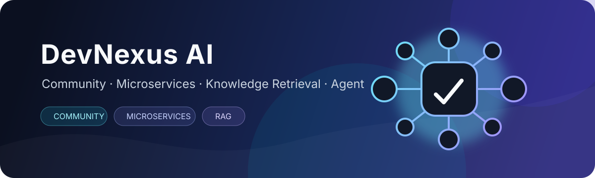
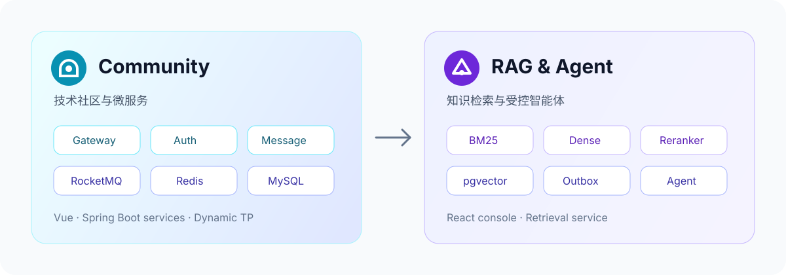

<div align="center">

# DevNexus AI

技术社区与 AI 知识平台

`Spring Boot 3` · `Spring Cloud Alibaba` · `RocketMQ` · `PostgreSQL` · `pgvector` · `Vue` · `React`

<br />



</div>

---

## 关于项目

DevNexus AI 是我的个人学习与求职作品集，包含技术社区、微服务、可靠消息、动态线程池、RAG 与 Agent 等方向的实践。

如果你对项目复现、技术方案或简历项目表达感兴趣，可以通过 GitHub Issue 与我交流。如果这个项目对你有所帮助，欢迎点一个 ⭐ **Star**，这会鼓励我继续维护和完善它。

<p align="center">
  
</p>

## 项目组成

| 目录 | 内容 | 使用说明 |
| --- | --- | --- |
| [`community/`](community/) | 社区后端、微服务与 Vue 前端 | [查看文档](community/README.md) |
| [`ragent/`](ragent/) | RAG 服务与 React 管理端 | [查看文档](ragent/README.md) |
| [`dynamic-tp/`](dynamic-tp/) | 动态线程池 Starter 与演示服务 | [查看文档](dynamic-tp/README.md) |

三个工程可以独立构建，也可以组合运行。

## 快速导航

- [环境要求](#环境要求)
- [启动社区服务](#启动社区服务)
- [启动-rag-服务](#启动-rag-服务)
- [停止服务](#停止服务)
- [构建项目](#构建项目)
- [AI 协作规则](#ai-协作规则)
- [当前状态与参与贡献](#当前状态与参与贡献)

## 环境要求

| 依赖 | 建议版本 |
| --- | --- |
| JDK | 17 |
| Maven | 3.9+ |
| Node.js | 20+ |
| Docker / Docker Compose | 当前稳定版本 |
| 命令行工具 | `curl`、`nc` |

## 启动社区服务

### 1. 安装动态线程池 Starter

首次构建时执行：

```bash
cd dynamic-tp
mvn clean install -DskipTests
cd ../community
```

### 2. 启动基础依赖

```bash
# MySQL、Redis、Nacos
docker compose -f ops/docker-compose.yml --profile full up -d mysql redis nacos

# RocketMQ
docker compose -f ops/rocketmq/docker-compose.yml up -d
```

默认数据库为 `pai_coding`。首次运行前，请确认
`community/paicoding-web/src/main/resources-env/dev/application-dal.yml`
中的数据库连接可用，并完成 Liquibase 初始化。

### 3. 启动后端服务

在多个终端中进入 `community` 目录，分别执行：

```bash
bash scripts/run-auth-service-dev.sh
bash scripts/run-aigc-service-dev.sh
bash scripts/run-message-service-dev.sh
bash scripts/run-web-with-remote-services-dev.sh
bash scripts/run-gateway-dev.sh
```

<details>
<summary>查看默认端口</summary>

| 服务 | 端口 |
| --- | ---: |
| Gateway | 10010 |
| Community Web | 8081 |
| Auth Service | 8093 |
| AIGC Service | 8094 |
| Message Service | 8095 |
| Nacos | 8848 |
| RocketMQ Dashboard | 8082 |

</details>

### 4. 启动 Vue 前端

```bash
cd community/pai-coding-front
npm ci
npm run dev
```

更完整的社区启动参数参见 [`community/README.md`](community/README.md)。

## 启动 RAG 服务

### 1. 启动依赖并构建

```bash
cd community
bash scripts/start-ragent-low-resource-dependencies.sh
bash scripts/build-ragent-integration-artifact.sh
```

### 2. 配置模型

如需调用真实模型，请通过环境变量注入密钥，不要将密钥写入配置文件：

```bash
export SILICONFLOW_API_KEY="your-key"
export OPENROUTER_API_KEY="your-key"
```

### 3. 启动后端

```bash
cd community
bash scripts/run-ragent-low-resource.sh
```

健康检查：

```bash
curl http://127.0.0.1:9090/api/ragent/actuator/health
```

### 4. 启动 React 管理端

```bash
cd ragent/frontend
cp .env.example .env
npm ci
npm run dev
```

更多 RAG 配置参见 [`ragent/README.md`](ragent/README.md)。

## 停止服务

```bash
cd community

bash scripts/stop-ragent-low-resource-dependencies.sh
docker compose -f ops/rocketmq/docker-compose.yml down
docker compose -f ops/docker-compose.yml --profile full down
```

## 构建项目

```bash
# 安装动态线程池 Starter
cd dynamic-tp
mvn clean install -DskipTests

# 构建社区工程
cd ../community
./mvnw clean package -DskipTests

# 构建 RAG 工程
cd ../ragent
./mvnw clean package -DskipTests
```

## AI 协作规则

仓库根目录的 [`AGENTS.md`](AGENTS.md) 是 AI 协作入口，[`.agents/`](.agents/) 保存资源、测试、可靠消息、RAG 与交付规则。支持该约定的 AI 在修改项目前应先读取入口文件，并按任务类型加载对应规则。

## 配置安全

- 不要提交 `.env`、API Key、Token、日志或运行时数据。
- 模型密钥应通过环境变量注入。
- 公开部署前请替换本地密码和内部服务 Token。

## 当前状态与参与贡献

本项目的社区后端、微服务、可靠消息和 RAG/Agent 主链路已经具备可运行实现。Vue 社区作品集与 React RAG 管理台已完成首轮工程化和界面整理；真实浏览器 E2E、社区 Agent 流式输出及更多移动端细节仍在持续完善。

如果你擅长 Vue、React、UI 设计或前后端联调，欢迎提交 Issue 或 Pull Request。功能建议、问题反馈和代码优化也同样欢迎。

## 许可

本仓库基于以下 Apache License 2.0 项目进行二次开发：

- [Paicoding](https://github.com/itwanger/paicoding)
- [Ragent](https://github.com/nageoffer/ragent)

许可证分别保留在 [`community/License`](community/License) 和
[`ragent/LICENSE`](ragent/LICENSE)。
